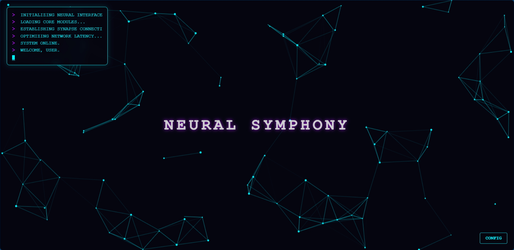

# Neural Symphony 🧠✨

> A seamless fusion of art and code.

**Neural Symphony** is an interactive, sci-fi inspired web visualization that simulates a neural network. It combines high-performance HTML5 Canvas rendering with a modern, glassmorphic React interface to create a premium digital experience.


*(Note: You can add a screenshot here later)*

## Key Features

- **Interactive Particle System**: A custom-written physics engine where nodes connect and react to mouse input.
- **Terminal Overlay**: Authentic system boot sequence with typing effects and retro aesthetics.
- **Glassmorphism UI**: Frosted glass controls to adjust simulation parameters in real-time.
- **Neon Aesthetics**: A curated cyberpunk color palette designed to pop on deep dark backgrounds.

## 🛠️ Tech Stack

- **Core**: React 18 + TypeScript
- **Build Tool**: Vite
- **Graphics**: HTML5 Canvas API (No heavy 3D libraries)
- **Styling**: Vanilla CSS + CSS Variables (No frameworks)

## Getting Started

1. **Clone the repository**
2. **Install dependencies**:

    ```bash
    npm install
    ```

3. **Run the development server**:

    ```bash
    npm run dev
    ```

4. **Open** `http://localhost:5173` to view the app.

## Controls

Open the **CONFIG** panel in the bottom-right to tweak:

- **Node Count**: Complexity of the network.
- **Synapse Range**: Connectivity distance.
- **Speed**: Simulation pacing.

---

*Generated by Antigravity*
